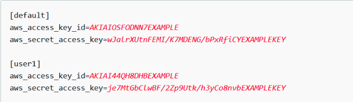

# MLOps with AWS Sagemaker
## 事前設定
### AWS credentials

1. 點選 AWS 儀表板首頁右上角（自己的帳號）
2. 點選 Security credentials
3. 點選 Create access key (依照自己的需求設定)
4. 編輯 ~/.aws/credentials 檔案內輸入 (替換成剛剛件好的 key)：
   

## Inference Deploy (Serving)

### Inference Real-Time Autoscaling
### Serverless Solution

### Batch Inference Solution
## Auto-Training Pipeline
### Training Pipeline
#### Add Training Trigger with Lambda

### Distributed Training

## 參考
1. Inference 範例：https://sagemaker-examples.readthedocs.io/en/latest/frameworks/pytorch/get_started_mnist_deploy.html
2. 內建 Image uri：https://docs.aws.amazon.com/zh_tw/sagemaker/latest/dg/notebooks-available-images.html
3. https://www.youtube.com/watch?v=YQyid2uLOvI
4. Github Image URI（主要用這個）：https://github.com/aws/deep-learning-containers/blob/master/available_images.md
5. sagemaker image uri gpu serve issue: https://huggingface.co/sanchit-gandhi/whisper-medium-fleurs-lang-id/discussions/2
6. paddlenlp uie sagemaker example: https://aws.amazon.com/cn/blogs/china/training-a-model-based-on-amazon-sagemaker-for-keyword-extraction-and-deployment/
7. bring your own container: https://sagemaker-examples.readthedocs.io/en/latest/advanced_functionality/scikit_bring_your_own/scikit_bring_your_own.html